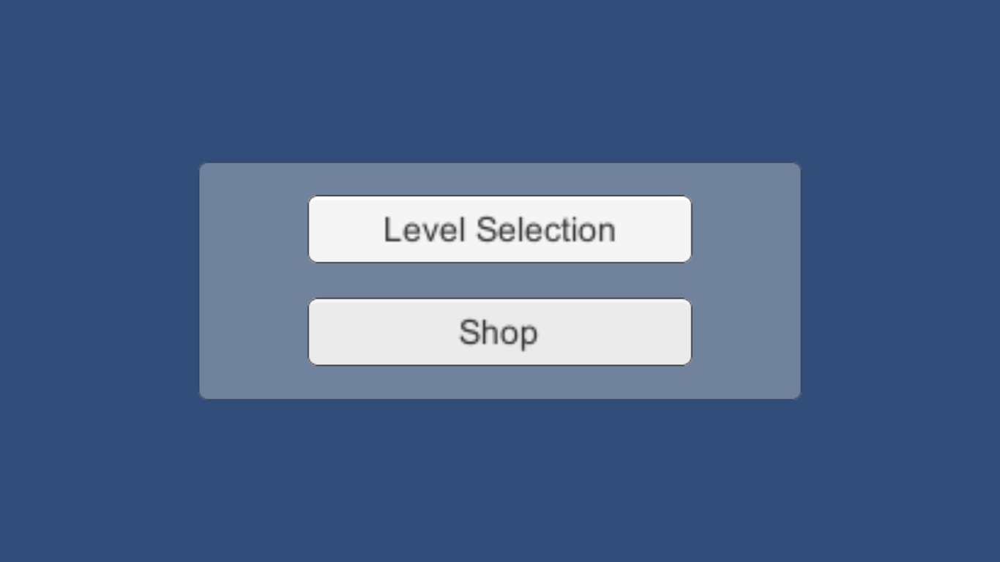
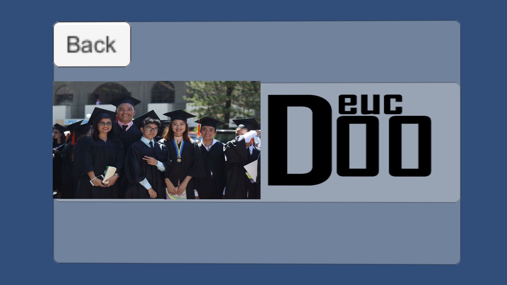
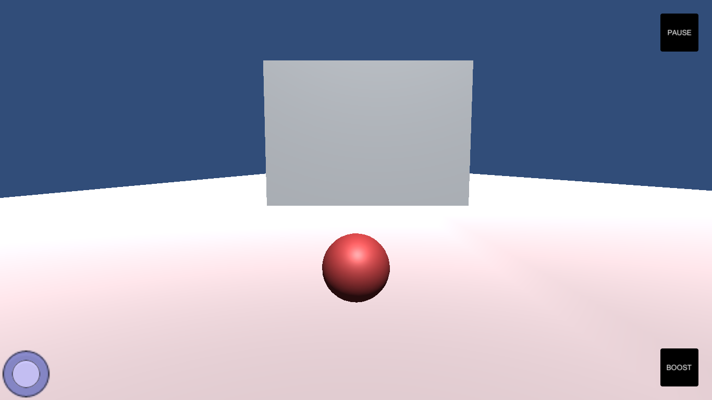
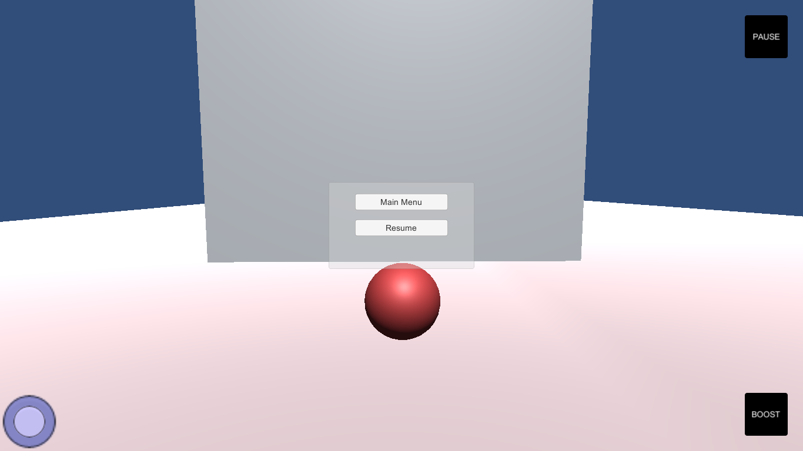
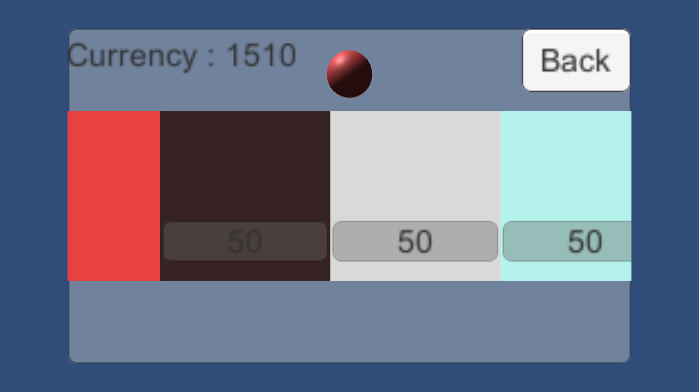

# 3D Ball Roller
3D Ball Roller is a 3D game developed in unity as a side project for practicing level UI design, level development and other features such as currency management and player skin changing. Currently has one level but future levels can be made and integrated into the game without any steps besides adding the game scene into one of the levels on the levels menu.

## Controls

* w - move forward
* a/swipe left - hard turn left
* d/swipe right - hard turn right
* s - move backward

space/boost button - speed boost

note: the controller on the lower left is usable in mobile.

## In game screenshots

### Main Menu

### Level Selection

### In game

### Pause

### Shop

